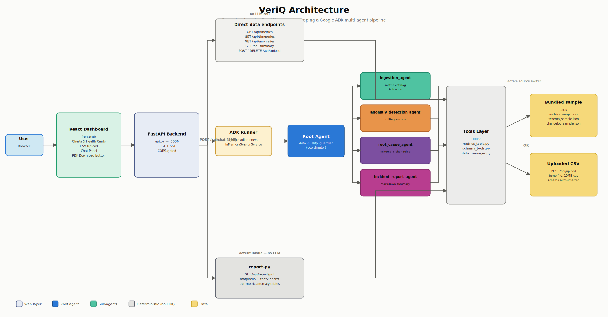

# VeriQ – Intelligent Data Quality Agent

VeriQ is a multi-agent data quality assistant that monitors product metrics, detects anomalies, and suggests likely root causes. It is built with the Google Agent Development Kit (ADK) and Gemini models as part of the **Google AI Agents Intensive (Nov 10–14, 2025) Capstone Project**.

> **Track fit:** Enterprise Agents  
> **Core idea:** Help teams trust their dashboards by catching data issues early and explaining *why* they happened.

---

## 1. Problem & Motivation

Modern products rely heavily on dashboards and analytics to drive decisions. But in most real stacks:

- Pipelines break silently.  
- Schema changes ripple through metrics in subtle ways.  
- Dashboards look “off” and no one is sure whether it’s real or a data bug.  
- Engineers lose hours manually checking queries, logs, and recent changes.

This creates **hidden risk**: leaders may make decisions based on incorrect, stale, or incomplete data.

**VeriQ** addresses this by acting as a *data quality co-pilot*:  
it inspects metrics, flags unusual behavior, and suggests plausible root causes using schema and changelog context, all through a conversational interface.

---

## 2. Solution Overview

VeriQ is implemented as a **multi-agent system** on top of the ADK:

- A **root coordinator agent** (`data_quality_guardian`) that:
  - Talks to the user.
  - Routes requests to specialized helper agents.
  - Aggregates their outputs into clean, readable markdown.

- Specialized sub-agents for:
  - Metric catalog & lineage.
  - Anomaly detection.
  - Root-cause hypothesis generation.
  - Human-readable incident reporting.

Under the hood, agents use **structured tools** that read from local demo data:

- A synthetic **metrics time series** – `data/metrics_sample.csv`  
- A simple **schema & lineage description** – `data/schema_sample.json`  
- A **change log** of recent schema / pipeline changes – `data/changelog_sample.json`  

This design mirrors a realistic analytics environment (e.g., a startup’s product metrics) while remaining lightweight and fully local for this capstone.

The tools are not hardcoded to this sample dataset, though — any CSV with a date column and at least one numeric column works. When a user uploads their own file through the dashboard, schema and lineage info is auto-inferred from the CSV structure instead of read from the bundled JSON files, so the same agents work against arbitrary metrics data.

---

## 3. Key Features (Course Concepts)

VeriQ demonstrates several core concepts from the AI Agents Intensive:

- ✅ **Multi-agent architecture**
  - One root coordinator agent.
  - Four specialized helper agents with focused responsibilities.

- ✅ **Tools**
  - Custom tools for metrics, schema, and changelog access:
    - `list_metrics`, `get_metric_timeseries`, `detect_metric_anomalies`
    - `get_schema_summary`, `get_metric_lineage`, `get_recent_changes`

- ✅ **Context and structured outputs**
  - Tools return structured dicts that agents can reason over.
  - Agents often respond with markdown + optional JSON style snippets for clarity and machine readability.

- ✅ **Separation of concerns**
  - Clear split between:
    - Data layer (CSV/JSON under `data/`)
    - Tools layer (`tools/*.py`)
    - Agent orchestration (`agent.py`)

- ✅ **Dynamic, schema-agnostic data layer**
  - Any CSV with a date column and numeric columns works — not just the
    bundled sample. `tools/data_manager.py` tracks the active source
    (sample vs. uploaded file) and `tools/schema_tools.py` auto-infers
    schema for uploads with no hardcoded metric names.

This base can be extended with:

- Sessions & memory (e.g. remembering past incidents).
- Observability, logging, and evaluation.
- Cloud deployment via Vertex AI Agent Engine or Cloud Run.

---

## 4. Architecture



The diagram reflects the current system: a React dashboard talks to the
FastAPI backend over REST + SSE. Most dashboard reads hit `tools/` directly
(no LLM call); only the chat panel goes through the ADK `Runner` and the
five-agent pipeline. PDF report generation (`report.py`) is also
deterministic — it reads the same tools layer but never calls the model.

### 4.1 Agent Roles

All agents are defined in `agent.py`.

| Agent Name               | Role                                                                 |
|--------------------------|----------------------------------------------------------------------|
| `data_quality_guardian`  | Root agent (VeriQ coordinator); user-facing; orchestrates sub-agents |
| `ingestion_agent`        | Lists metrics; provides time-series and lineage context              |
| `anomaly_detection_agent`| Detects anomalies in a single metric’s time series                   |
| `root_cause_agent`       | Suggests likely root causes using schema + changelog data           |
| `incident_report_agent`  | Produces a clean, readable incident report                          |

#### Root Coordinator: `data_quality_guardian`

- The only agent that talks directly to the user.
- Interprets user intent and decides whether to:
  - List available metrics.
  - Run anomaly detection on a metric.
  - Explore possible root causes.
  - Generate an incident-style summary.

It calls helper agents as sub-agents and hides internal complexity behind a simple conversational experience.

#### `tools/metrics_tools.py`

- `list_metrics()`:  
  Reads the active dataset (bundled sample or uploaded CSV) and returns its
  numeric columns as available metric names.

- `get_metric_timeseries(metric_name, start_date=None, end_date=None)`:  
  Returns a list of `{date, value}` points for the selected metric.

- `detect_metric_anomalies(metric_name, window_size=14, z_threshold=2.0)`:  
  Uses a time-based rolling mean/std (current point excluded from its own
  window) to compute z-scores and flags points where
  `abs(z_score) >= z_threshold`. Returns:
  ```jsonc
  {
    "metric": "daily_active_users",
    "n_anomalies": 1,
    "anomalies": [
      {
        "date": "2025-11-15",
        "value": 600.0,
        "z_score": -3.33,
        "direction": "low"
      }
    ]
  }
  ```

---

## 5. Web app

VeriQ ships with a full web product on top of the agents:

- **FastAPI backend** (`api.py`) — REST endpoints (`/api/metrics`,
  `/api/timeseries`, `/api/anomalies`, `/api/summary`), CSV upload with
  validation, a streaming chat endpoint (`/api/chat`, SSE), and **automated
  PDF data quality reports** (`/api/report/pdf`, via `report.py`).
- **React dashboard** (`frontend/`) — time-series charts with anomalies
  flagged, dataset health cards, adjustable detection window / z-threshold,
  CSV upload with instant re-analysis, and a streaming chat panel wired to
  the multi-agent pipeline. Works with **any** metrics CSV that has a date
  column and numeric columns.

### Run locally

Backend (Python 3.13):

```bash
python3 -m venv venv && source venv/bin/activate
pip install -r requirements.txt
cp .env.example .env   # add your GOOGLE_API_KEY
python api.py          # http://localhost:8080
```

Frontend:

```bash
cd frontend
npm install
npm run dev            # http://localhost:5173 (proxies /api to :8080)
```

## 6. Deployment (Railway backend + Vercel frontend)

**Backend → Railway** (Dockerfile + `railway.toml` included):

1. Push the repo to GitHub and create a new Railway project from it.
2. Railway detects the Dockerfile; set environment variables:
   - `GOOGLE_API_KEY` — your Gemini key
   - `CORS_ORIGINS` — your Vercel URL (e.g. `https://veriq.vercel.app`)
3. Deploy; note the public URL (health check at `/health`).

**Frontend → Vercel**:

1. Import the repo in Vercel and set the **root directory** to `frontend/`.
2. Set env var `VITE_API_URL` to the Railway URL (no trailing slash).
3. Deploy. If you change the Vercel domain, update `CORS_ORIGINS` on Railway.
